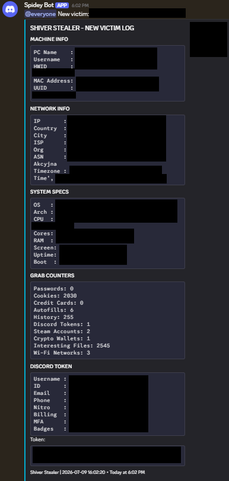

# Shiver Stealer

<div align="center">



**Advanced Multi-Feature Information Gathering Tool**

[](https://www.python.org/)
[](https://www.microsoft.com/windows)
[](LICENSE)

</div>

## Overview

Shiver Stealer is a sophisticated, production-ready information gathering utility designed for educational and authorized security assessment purposes. Built with Python and compiled to a standalone executable, it provides comprehensive data collection capabilities across multiple attack vectors while maintaining operational stealth through advanced obfuscation and anti-detection mechanisms.

## Features

### Browser Data Extraction

**Supported Browsers (45 Total)**

| Category | Browsers |
|----------|----------|
| **Chromium-Based (34)** | Google Chrome, Chromium, Brave, Microsoft Edge, Opera, Opera GX, Vivaldi, Yandex, Comodo Dragon, Avast Browser, AVG Browser, SRWare Iron, Slimjet, Epic Privacy Browser, Cent Browser, CocCoc, Maxthon, Arc, Zen Browser, Mullvad Browser, Comet, Comodo IceDragon, Chedot, Sputnik, Torch, Uran, 7Star, Elements Browser, Amigo, Orbitum, Kometa, QIP Surf, DuckDuckGo, Tor Browser |
| **Firefox-Based (11)** | Mozilla Firefox, Waterfox, LibreWolf, Pale Moon, SeaMonkey, Basilisk, K-Meleon, Otter Browser, Midori, Floorp, Falkon |

**Extracted Data:**
- Login credentials (passwords) with AES-GCM decryption
- Session cookies in Netscape format
- Credit card information
- Autofill form data
- Browsing history with timestamps

### Discord Token Acquisition

**Supported Clients (19 Total)**

Discord, Discord Canary, Discord PTB, Discord Development, Lightcord, Vesktop, Vencord, Nightcord, ArmCord

**Capabilities:**
- Token extraction from LevelDB storage
- Chrome-style DPAPI decryption for encrypted tokens
- Token validation via Discord API
- Comprehensive account information:
  - User ID, username, discriminator
  - Email address, phone number
  - Nitro status and type
  - Billing methods (PayPal, credit cards)
  - MFA status
  - User badges and flags
  - Friend list and guild memberships

### Cryptocurrency Wallet Theft

**Supported Wallets (60+ Extensions)**

| Wallet | Extension ID |
|--------|--------------|
| MetaMask | `nkbihfbeogaeaoehlefnkodbefgpgknn` |
| Phantom | `bfnaelmomeimhlpmgjnjophhpkkoljpa` |
| Rabby | `acmacodkjbdgmoleebolmdjonilkdbch` |
| Coinbase Wallet | `hnfanknocfeofbddgcijnmhnfnkdnaad` |
| Binance Wallet | `fhbohimaelbohpjbbldcngcnapndodjp` |
| Keplr | `dmkamcknogkgcdfhhbddcghachkejeap` |
| Nami | `lpfcbjknijpeeillifnkikgncikgfhdo` |
| Ronin Wallet | `bblcdmnaokkbpjhbfaoplfihdppbgb` |
| Trust Wallet | `egjidjbpglichdcondbcbdnbeeppkphb` |
| Math Wallet | `afbcbjpbpfadlkmhmclhkeeodmamcflc` |
| Terra Station | `aiifbnbfobpmeekipheeijimdpnlpgpp` |
| Martian Wallet | `cpcjdphnpdjjajagadejpbjnfdkfbhpb` |
| Petra | `ejjladineckdgjemeijbdahhhbhehdoe` |
| Fewcha | `jdkknndbebbapbiloaofgmceiiphokap` |
| Pontem | `phkbamefinggmakgklpkljjmgibohnba` |
| Solflare | `bhhhlbepdkbapadjdnnojkbgioiodbic` |
| Exodus | `aholpfdialjgjfhomihkjbmgjidlcdno` |
| Tally | `eipmnfdnkjofgnpjjdgmfnaoibgklnjc` |
| Frame | `ejbalbakoplchlghecdalmeeeajnimhm` |
| Liquality | `kpfopkelmcoipemdgiijsikoboeppfom` |
| XDEFI | `hmeobnfnfcmdkdcmlblgagmfpfboieaf` |
| Core | `agoakfejjabomempkjlepdflaleeobhb` |
| SubWallet | `onhogfjeacnfoofkfgppdlbmlmnplgbn` |
| Talisman | `fijngjgcjhjmmpcmkeiomlglpeiijkld` |
| Polkadot.js | `fhmfendgdocmcbmfikdcogofphimnkno` |
| Yoroi | `ffnbelfdoeiohenkjibnmadjiehjhajb` |
| Eternl | `kmhcihpebfmpgmihbkipmjlmmioameka` |
| Flint | `hnhobjmcibchnmglfbldbfabcgaknlkj` |
| GeroWallet | `bikervjbuzqmfgdlhifppjbfflbnkoki` |
| Begin Wallet | `jinjaccalgkegednnccohejagnlnfdag` |
| BYONE | `fhilaheimglignddkjgofkcbgekhenbh` |
| SafePal | `lgmpcpglpngdoalbgeoldeajfclnhafa` |
| OneKey | `jnmbobjmhlngoefaiojfljckilhhlhcj` |
| imToken | `nlbmnnijcnlegkjjpcfjclmcfggfefdm` |
| TP Wallet | `mfgccjchihfkkindfppnaooecgfneiii` |
| BitKeep | `jiidiaalihmmhddjgbnbgdfflelocpak` |
| OKX Wallet | `mcohilncbfahbmgdjkbpemcciiolgcge` |
| Kraken | `ifbboakaemklalnlmnpdkeiifbfijjlm` |
| Enkrypt | `gkjbkjkpjpdpbhkdpjlnjlnjlnjlnjln` |
| MyCrypto | `nlgbhdfgdhgbiamfdfmbikcdghjaddom` |
| Harmony | `fnnegphlobjdpkhecapkijjdkgcjhkib` |
| ICONex | `flpiciilemghbmfalicajoolhkkenfel` |
| Wombat | `amkmjjmmflddogmhpjloimipbofnfjih` |
| Guild Wallet | `nanjmdknhkinifnkgdcggcfnhdaammmj` |
| Neoline | `cphhlgmgameodnhkjdmkpanlelnlohao` |
| Cyano | `dkdedlpgdmmkkfjabffeganieamfklkm` |
| OntoWallet | `oplligpicccjckpbcjkfdpogfcbgpmkl` |
| Concordium | `abjcfabbhafbcdfjoecdgepllmpfceif` |
| Alephium | `oaogpojkjpmjnkebcnldlkmjcpmiodcg` |
| Sui Wallet | `opcgpfmipidbgpenhmajajpdcbmgilic` |
| Manta | `hpglgdghhkapgdjpbmkbkpnkjkbgbfde` |
| Nightly | `fidojkfdpbkfaijipobknkdlifdcfemp` |
| Backpack | `aflkmfhebedbjioipglgcbcmnbpgliof` |
| Grindery | `jdogphakondfdmcanicanmbfaangegaf` |
| Starcoin | `mfhbebgoclkghebffdldpobeajmbecfk` |
| Kukai | `ookjlbkiijinhpmnjffcofjonbfbgaoc` |
| Temple | `ookjlbkiijinhpmnjffcofjonbfbgaoc` |
| Spire | `hbcennhacfaagdopikcegfcobcadeocj` |
| Nufinetes | `kiopjekfhmcphcqnfahhncbfbggaagdj` |
| Alby | `kmeopaelnckbmkpgdnlkcajoaifmhkpd` |

**Desktop Wallets:**
- Exodus, Atomic, Electrum, Coinomi, Wasabi Wallet

### Gaming Account Theft

**Steam**
- Session hijacking via ssfn files
- Login credentials from `loginusers.vdf`
- User data directory extraction
- Registry path detection

**Minecraft**
- Launcher account tokens
- Session authentication data
- Client tokens from `launcher_profiles.json`

**Roblox**
- `.ROBLOSECURITY` cookie extraction
- Account verification via mobile API
- Robux balance and premium status

### Social Media Integration

**Instagram**
- Session ID extraction from browser cookies
- Account information via Instagram API
- Follower/following counts
- Profile metadata

**Telegram**
- Session data from `tdata` directory
- Account authentication files
- Complete session archive

### System Information

**Hardware & OS:**
- Hostname, username, HWID
- MAC address, UUID
- Windows version, architecture
- CPU specifications (model, cores)
- RAM usage statistics
- Screen resolution
- System uptime and boot time
- Installation date
- Timezone information

**Network:**
- Public IP address
- Geolocation (country, city, ISP)
- ASN information
- Local IP address

**Wi-Fi Networks:**
- Saved network profiles via `netsh`
- Network passwords in plaintext

### File System Search

**Kiwi File Scanner**
- 116 targeted keywords for sensitive file detection
- Recursive directory traversal with depth control
- 45-second execution timeout
- Content preview for text files (2KB limit)
- Skip system directories and hidden folders

**Keyword Categories:**
- Credentials: password, login, secret, account
- Financial: paypal, bank, crypto, wallet, binance
- Gaming: steam, discord, riotgames, epicgames
- Social: instagram, tiktok, twitter, facebook
- Development: api_key, ssh, aws, azure, docker
- And 80+ additional keywords

### SSH Connection Theft

**Supported Clients:**
- PuTTY (registry-based session extraction)
- KiTTY (registry-based session extraction)
- WinSCP (registry-based session extraction)
- mRemoteNG (XML configuration parsing)
- SecureCRT, MobaXterm, Xshell, Termius
- And 15+ additional SSH/FTP clients

**Extracted Data:**
- Session names and hostnames
- Username credentials
- Port configurations
- Connection parameters

### Advanced Features

**Process Management**
- Intelligent browser process detection via `psutil`
- Selective process termination for data access
- Automatic process restoration after extraction
- UWP application support (DuckDuckGo)

**Anti-Detection**
- Console window hiding via Win32 API
- Virtual machine detection (HWID, hostname, username blacklists)
- Process model inspection (VMware, VirtualBox, QEMU, Xen)
- Configurable anti-VM bypass

**Fake Error Dialog**
- Customizable error message box
- Configurable title, message, and icon type
- Error/Warning/Info/Question dialog styles
- Distraction technique for user

**Persistence**
- Registry-based startup (`HKCU\Software\Microsoft\Windows\CurrentVersion\Run`)
- Startup folder shortcut creation
- Optional enable/disable via builder

**Code Obfuscation**
- Marshal serialization
- Zlib compression
- Base64 encoding
- No external obfuscation dependencies

**Discord Webhook Integration**
- Structured embed messages with color coding
- Separate file attachments for each data category
- Batch file upload (8 files per message)
- Thumbnail support for Discord avatars
- @everyone mention on new victim

## Builder Configuration

The interactive builder menu provides the following configuration options:

| Option | Description |
|--------|-------------|
| **Webhook URL** | Discord webhook endpoint for data exfiltration (required) |
| **Obfuscation** | Enable marshal+zlib+base64 code obfuscation |
| **Startup** | Enable persistence via registry and startup folder |
| **Anti-VM** | Enable virtual machine detection and evasion |
| **Fake Error** | Configure custom error dialog display |
| **Output Name** | Custom executable filename |
| **Dependencies** | Automatic installation of required Python packages |

## Technical Specifications

**Encryption & Decryption:**
- Chrome/Edge/Brave: AES-256-GCM with DPAPI master key
- Firefox: AES-256-GCM with key4.db master key derivation
- PBKDF2-SHA256 key derivation (1 iteration)
- Windows DPAPI `CryptUnprotectData` for legacy encryption

**Database Handling:**
- SQLite3 for Chrome-based browser databases
- Temporary database copying to avoid file locks
- Automatic cleanup of temporary files

**Threading Model:**
- Parallel browser extraction (thread-per-browser)
- Concurrent Discord client scanning
- Synchronized data collection with thread-safe locks
- Timeout-controlled file system search

**PyInstaller Compilation:**
- Single-file executable (`--onefile`)
- No console window (`--noconsole`)
- Submodule collection for core package
- Hidden imports for all dependencies
- Metadata preservation for psutil

## Installation

### Prerequisites

- Python 3.8 or higher
- Windows 10/11 (x64)
- Git (optional, for cloning)

### Setup

```bash
git clone https://github.com/YOUR_USERNAME/shiver-stealer.git
cd shiver-stealer
pip install -r requirements.txt
```

### Dependencies

| Package | Version | Purpose |
|---------|---------|---------|
| requests | >=2.28.0 | HTTP requests and webhook communication |
| pycryptodome | >=3.15.0 | AES encryption/decryption |
| psutil | >=5.9.0 | Process management and system info |
| Pillow | >=9.0.0 | Screenshot capture |
| pyinstaller | >=5.0.0 | Executable compilation |

## Usage

### Quick Start

```bash
python shiver.bat
```

Select option **[1]** to launch the builder menu.

### Builder Workflow

1. **Set Webhook URL** - Configure your Discord webhook endpoint
2. **Configure Options** - Enable/disable obfuscation, startup, anti-VM
3. **Build Stub** - Compile to standalone executable
4. **Distribute** - Deploy the generated `.exe` file

### Command Line

```bash
python builder.py --build-auto    # Build with current config
python builder.py --install-deps  # Install dependencies
```

## Output Structure

The stealer generates the following files for exfiltration:

| File | Content |
|------|---------|
| `shiver_passwords.txt` | Decrypted login credentials |
| `shiver_cookies.txt` | Session cookies (Netscape format) |
| `shiver_credit_cards.txt` | Credit card information |
| `shiver_autofills.txt` | Autofill form data |
| `shiver_discord_tokens.txt` | Discord account tokens and info |
| `shiver_wifi_passwords.txt` | Wi-Fi network credentials |
| `shiver_interesting_files.txt` | Sensitive file discoveries |
| `shiver_history.txt` | Browsing history by browser |
| `shiver_extra_data.txt` | Gaming, social, and miscellaneous data |
| `*.zip` | Web3 wallet extensions, Steam sessions, Telegram data |

## Webhook Output Example

The Discord webhook delivers a structured embed containing:

- **Machine Info**: PC name, username, HWID, MAC, UUID
- **Network Info**: IP, country, city, ISP, ASN, timezone
- **System Specs**: OS, architecture, CPU, RAM, screen, uptime
- **Grab Counters**: Passwords, cookies, credit cards, autofills, history, Discord tokens, Steam accounts, crypto wallets, interesting files, Wi-Fi networks
- **Discord Token**: Username, ID, email, phone, nitro, billing, MFA, badges, token (with avatar thumbnail)

All data files are attached as separate uploads in batches of 8 files per message.

## Security Considerations

**Educational Purpose Only**

This tool is designed for authorized security assessments and educational purposes. Unauthorized use against systems you do not own or have explicit permission to test is illegal and unethical.

**Detection Evasion**

- No harmful payloads or destructive code
- Information gathering only
- Obfuscation to prevent static analysis
- Anti-VM detection to avoid sandbox analysis
- Process restoration to minimize user suspicion

**Data Handling**

- All temporary files are cleaned after extraction
- No local storage of stolen data
- Direct exfiltration to configured webhook
- No callback or C2 infrastructure required

## Project Structure

```
shiver-stealer/
├── builder.py              # Interactive builder and compiler
├── requirements.txt        # Python dependencies
├── shiver.bat             # Windows launcher script
├── shiver_config.json     # Builder configuration
├── shiver.png             # Screenshot example
├── .gitignore             # Git ignore rules
└── core/                  # Core modules
    ├── __init__.py
    ├── browsers.py        # Browser data extraction (45 browsers)
    ├── discord.py         # Discord token acquisition (19 clients)
    ├── gaming.py          # Gaming account theft (Steam, Minecraft, Roblox)
    ├── kiwi.py            # File system search (116 keywords)
    ├── social.py          # Social media integration (Instagram)
    ├── ssh.py             # SSH connection theft (20+ clients)
    ├── stealer.py         # Main orchestrator
    ├── system.py          # System information gathering
    ├── utils.py           # Shared utilities and cryptography
    ├── wallets.py         # Desktop wallet theft
    ├── web3.py            # Web3 wallet extensions (60+ wallets)
    └── webhook.py         # Discord webhook formatting
```

## Contributing

Contributions, issues, and feature requests are welcome. Feel free to check the [issues page](https://github.com/YOUR_USERNAME/shiver-stealer/issues).

## License

This project is licensed under the MIT License - see the [LICENSE](LICENSE) file for details.

## Disclaimer

This software is provided for educational and authorized security testing purposes only. The authors are not responsible for any misuse or damage caused by this program. Always obtain proper authorization before testing any system you do not own.

## Support

For issues, questions, or contributions, please open an issue on GitHub.

---

<div align="center">

**Shiver Stealer** - Advanced Information Gathering Utility

*Built with Python | Compiled with PyInstaller | Obfuscated with marshal+zlib+base64*

</div>
